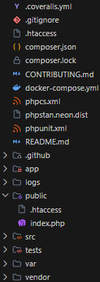

# PHP-Slim

<br />

## 1.0 - What is PHP-Slim

- Slim is a PHP micro-framework for building web applications and APIs.
- It is a lightweight framework that is easy to learn and use.
- Slim is a good choice for building small to medium-sized web applications and APIs.

<br />

## 2.0 - Installation & Setup (Xampp Apache)

- Download and install [Composer](https://getcomposer.org/download/) first.
- Open "php.ini" and replace the ";extension=zip" with "extension=zip".
- Run this command in the directory where you want to install Slim:
  ```html
  composer create-project slim/slim-skeleton <folderName>
  ```

- To run it on Apache server, you need to setup the "httpd.conf" of Apache.
  ```html
  <Directory "D:/xampp/public">
    ...
  </Directory>

  <Directory "<pathToFolder>/public">
    Options Indexes FollowSymLinks Includes ExecCGI
    AllowOverride All
    Require all granted
  </Directory>

  ...
  
  <IfModule alias_module>
    ...
    Alias <folderName> <pathToFolder>/public
    ...
  </IfModule>
  ```
  Example:
  ```html
  <Directory "D:/php_slim/public">
    Options Indexes FollowSymLinks Includes ExecCGI
    AllowOverride All
    Require all granted
  </Directory>

  ...
  
  <IfModule alias_module>
    ...
    Alias /php_slim D:/php_slim/pub
    ...
  </IfModule>
  ```

- To run the application on certain port (ensure you under project root directory):
  ```html
  php -S localhost:<port> -t public
  Example: php -S localhost:8000 -t public
  ```

- To open the application in the browser, use the following URL:
  ```html
  http://localhost:<port>/<folderName>
  Example: http://localhost:8000/php_slim
  ```

<br />

## 3.0 - Commands

```html
composer install
  | Install all dependencies listed in composer.json of a project.
  | Run it when you first download/clone a new project or if you deleted the vendor folder.
  | Your current directory must be the folder containing the composer.json file.

composer start
  | Start the built-in PHP development server using settings defined in composer.json.
  | By default, it runs the application on http://localhost:8080.

php -S localhost:<port> -t public
  | Run PHP built-in server manually to host the public folder at localhost:<port>.
  | Example: "php -S localhost:8000 -t public" runs it on port 8000.

composer test
  | Run the unit and integration tests defined for the project (using PHPUnit).

composer dump-autoload
  | Regenerate the Composer autoloader.
  | Run it after adding new classes or changing namespaces in the project.
```

<br />

## 4.0 - PHP-Slim Project Structure

<p align="center" width="100%">
    <br>
    PHP-Slim Project Structure.
</p>

<br />

| File / Directory | Description | |
| :--- | :--- | :--- |
| **`.coveralls.yml`** | Configures code coverage report upload to Coveralls. | Coveralls CI Configuration |
| **`.gitignore`** | Specifies which files Git should ignore (e.g., vendor, logs, cache). | Git File |
| **`.htaccess`** | Apache configuration to redirect traffic and handle URL rewrites to the public folder. | Apache Config File |
| **`composer.json`** | Defines project metadata, configuration, autoloading rules, and dependencies. | Project Configuration File |
| **`composer.lock`** | Locks dependency versions to ensure consistency across environments. | Project Configuration File |
| **`CONTRIBUTING.md`** | Guidelines for contributing code to the project. | Documentation File |
| **`docker-compose.yml`** | Configures Docker services for running the application in containers. | Docker File |
| **`phpcs.xml`** | Configures coding standard rules for PHP CodeSniffer. | Coding Standard Configuration |
| **`phpstan.neon.dist`** | Configures rules for PHPStan static analysis and type checking. | Static Analysis Configuration |
| **`phpunit.xml`** | Configuration file for PHPUnit testing framework. | Testing File |
| **`README.md`** | The main documentation file for the project. | Documentation File |
| **`.github/`** | Contains GitHub Actions CI/CD workflows and issue templates. | CI/CD Workflows |
| **`app/`** | Contains application setup files, including dependencies, middleware, and routes. | Application Setup |
| ├ **`dependencies.php`** | Registers dependencies and services in the dependency injection container. | |
| ├ **`middleware.php`** | Configures global middleware for the application request-response lifecycle. | |
| ├ **`repositories.php`** | Binds repository interfaces to their concrete implementations. | |
| ├ **`routes.php`** | Defines the URL endpoints and maps them to controllers or closures. | |
| └ **`settings.php`** | Configures application-wide settings (e.g., db credentials, logging level). | |
| **`logs/`** | Directory where application log files (e.g., app.log) are stored. | Log Files |
| **`public/`** | The public-facing root directory containing the front controller. | Public Web Directory |
| ├ **`.htaccess`** | Apache configuration for URL rewriting to forward requests to the entry point. | Apache Config File |
| └ **`index.php`** | The entry point that bootstraps and runs the PHP-Slim application. | Front Controller |
| **`src/`** | Contains the core business logic (Domain, Infrastructure, Application layers). | Application Codes |
| ├ **`Application/`** | Contains application services and request handlers (Actions). | |
| ├ **`Domain/`** | Contains domain models, services, and repository interfaces. | |
| └ **`Infrastructure/`** | Contains concrete implementations of databases and repositories. | |
| **`tests/`** | Contains unit and integration tests (PHPUnit) for the application. | Testing Codes |
| **`var/`** | Contains temporary runtime files and cache used by the framework. | Cache Files |
| **`vendor/`** | Contains third-party libraries and dependencies installed via Composer. | Dependency Directory |

<br />

## 5.0 - Rules to Access Different Routes

Slim is a front-controller-based framework. Understanding how requests are routed and handled is key:

### 1. The Main Entry Point (`index.php`)
- `index.php` is the bootstrap and front controller. It imports Slim, builds the `$app` instance, binds middleware, imports route definitions, and executes the runtime loop via `$app->run()`.
- The route files outside the `index.php` **MUST** be loaded using `require` or `include` inside `index.php` to register their paths.
- **Direct Access Check**:
  - Direct execution of route files will fail with an error because they do not declare the `$app` instance in their local scope. They inherit `$app` from `index.php` during inclusion.
  - Conversely, if `index.php` does not require/include the route file, those routes will not be registered, and accessing them via the Slim app will return a `404 Not Found` error.

### 2. Base Path Configuration
- If your Slim application runs in an Apache subdirectory/alias (e.g. `/cpad-slim`), you must configure Slim to strip this path prefix before route matching using:
  ```php
  $app->setBasePath('/cpad-slim');
  ```
- This ensures that a request to `/cpad-slim/menus` is correctly matched against the defined route `/menus`.

### 3. Serving Standalone Client Files (.php or .html)
- By default, web servers (like Apache) redirect all requests to `index.php` via URL rewriting rules.
- However, if the request targets an actual physical file that exists on the disk, the rewrite rule will skip forwarding to `index.php` due to the rule condition:
  ```apache
  RewriteCond %{REQUEST_FILENAME} !-f
  ```
- This allows serving standalone PHP or HTML files (such as frontend client forms or utility scripts) directly, executing them independently in the browser without going through Slim's router.

<br />

## 6.0 - HTTP Responses from Server (PSR-7 Syntax)

Slim routes use PSR-7 `ResponseInterface` methods to construct and send structured JSON payloads back to the client.

### 1. The Standard Payload Design
To ensure frontend clients can read responses predictably, we return a structured JSON layout:
```php
$payload = [
    'success' => true,  // Boolean status indicator.
    'error'   => null,  // Error message string or null.
    'data'    => $data  // Resource arrays or IDs.
];
```

### 2. Returning a Response (Syntax)
PSR-7 messages are immutable. Modifying them returns a new cloned response instance. Responses are populated and set as follows:
```php
use Psr\Http\Message\ResponseInterface as Response;
use Psr\Http\Message\ServerRequestInterface as Request;

$app->post('/menus', function (Request $request, Response $response, array $args) {
    $payload = ['success' => true, 'error' => null, 'data' => ['id' => 1]];

    // 1. Do the required operation.

    // 2. Write the payload string to the response body stream.
    $response->getBody()->write(json_encode($payload));

    // 3. Return a cloned response with status code and headers.
    return $response
        ->withStatus(201) // 201 Created Status.
        ->withHeader('Content-Type', 'application/json'); // Set headers.
});
```

<br />

## 7.0 - HTTP Requests from Client (Vue.js / JavaScript Fetch)

Clients interact with Slim backend endpoints asynchronously using `fetch()` and Vue.js.

The browser client constructs request payloads using method configurations, headers, and body options. In Vue.js:
```javascript
// POST Request Example using Promise Chains (.then())
fetch('/cpad-slim/menus', {
    method: 'POST',
    headers: {
        'Content-Type': 'application/json',
        'Accept': 'application/json'
    },
    body: JSON.stringify({
        name: 'Cold Lemon Tea',
        type: 'Drink',
        price: 3.50
    })
})
.then(res => res.json())
.then(json => {
    if (json.success) {
        console.log('Created ID: ' + json.data.id);
    } else {
        alert('Failed: ' + json.error);
    }
})
.catch(err => alert('Request Error: ' + err.message));
```
