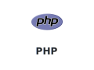
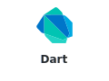
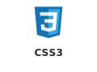

# Hi, I'm NG JAA WEI

An enthusiastic and detail-oriented individual with a strong passion for computer science and software development. Continuously seeking opportunities to learn new technologies and contribute to meaningful projects.

---

<h2 align="center">Tech Stack</h2>

<h3 align="center">Languages</h3>

  
  
  
  

  
  
  
  

<h3 align="center">Frontend & Frameworks</h3>

  
  
  
  
  

<h3 align="center">Databases & Cloud</h3>

  
  
  
  
  

<h3 align="center">Tools & Technologies</h3>

  
  
  
  

---

### "There are two ways to write error-free programs; only the third one works."

